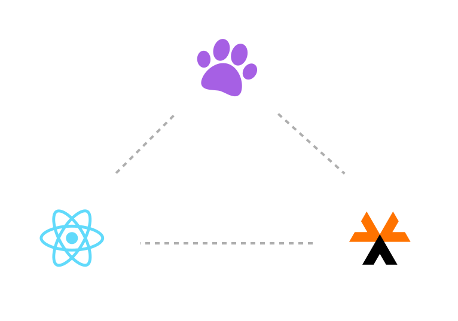

# Happy Pets App

<p align="center">
    
</p>

Sample app built with [Asgardeo React SDK](https://github.com/asgardeo/asgardeo-auth-react-sdk) to demonstrate [Asgardeo](https://wso2.com/asgardeo) login integration.

## Setting Up

### Installing Dependencies

Execute the following command from the root of the project.

```bash
# From the root
npm install
```

## Configuring the SDK

Open up the `index.js` file and configure the [AuthProvider](https://github.com/asgardeo/asgardeo-auth-react-sdk#authprovider) with the following configurations obtained from the Application that you created on Asgardeo.

| Configuration     | Description | Example
| ----------- | ----------- | ----------- |
| clientID               | The OAuth 2.0 Client Identifier valid at the authorization server.                            | amkyCEfrTFXFv92C4De6SGDORi0f
| serverOrigin           | The origin of the Identity Provider                                                          | https://api.asgardeo.io/t/happypets
| signInRedirectURL      | The URL that determines where the authorization code is sent to upon user authentication.    | https://localhost:3000
| signOutRedirectURL     | The URL that determines where the user is redirected to upon logout.                         | https://localhost:3000
| scope                  | These are the set of scopes that are used to request user attributes.                        | [ "openid","profile"]

Following is a sample snippet of the configured `AuthProvider` with the above example values.

```tsx
<AuthProvider
    config={ {
        signInRedirectURL: "https://localhost:3000",
        signOutRedirectURL: "https://localhost:3000",
        clientID: "amkyCEfrTFXFv92C4De6SGDORi0f",
        serverOrigin: "https://api.asgardeo.io/t/happypets",
        scope: [ "openid","profile" ]
    } }
>
    <App/>
</AuthProvider>
```

If you need further instructions, follow [this guide](https://wso2.com/asgardeo/docs/get-started/try-your-own-app/react/) from our Official Documentation.

## Running the App

To run the app you can execute the following command from the root of the project.

```bash
# From the root
npm start
```

## Building the Samples

Execute the following command from the root of the project.

```bash
# From the root
npm run build
```
