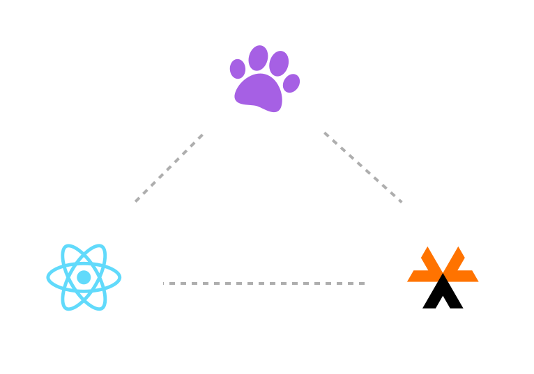
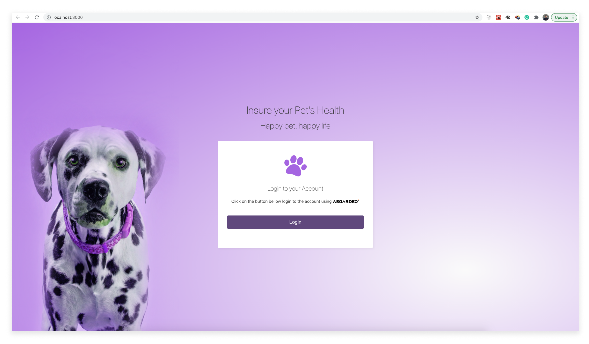
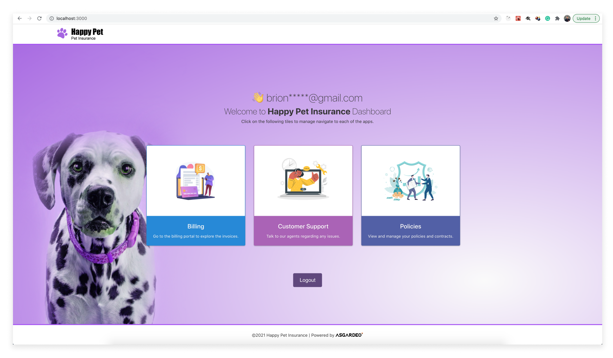

# Happy Pets App

<p align="center">
    
</p>

Sample app built with [Asgardeo React SDK](https://github.com/asgardeo/asgardeo-auth-react-sdk) to demonstrate [Asgardeo](https://wso2.com/asgardeo) login integration.

## Prerequisites

### Node.js & npm

You need to have [`npm`](https://www.npmjs.com/) with [`Node.js`](https://nodejs.org/en/). If you don't have them installed on your local environment, install the LTS(Latest stable version) version of Node.js which includes `npm` from the [official downloads page](https://nodejs.org/en/download/).

### An account on Asgardeo

You need to join an organization in Asgardeo. Follow the [documentation](https://wso2.com/asgardeo/docs/get-started/create-asgardeo-account/#sign-up) and create an account along with an organization in Asgardeo.

### An application on Asgardeo

You need to have a single-page application registered in Asgardeo in order to try out this integration.
Follow [this guide](https://wso2.com/asgardeo/docs/guides/applications/register-single-page-app/) and register an application if you haven't already got one.

### A customer user account

Only customer users can log in to applications. Create a [customer account](https://wso2.com/asgardeo/docs/guides/users/manage-customers/#onboard-customer-user) if you don't already have one.

## Setting Up

### Installing Dependencies

Execute the following command from the root of the project.

```bash
# From the root
npm install
```

## Configuring the SDK

Open up the `index.js` file and configure the [AuthProvider](https://github.com/asgardeo/asgardeo-auth-react-sdk#authprovider) with the following configurations obtained from the Application that you created on Asgardeo.

| Configuration     | Description | Example
| ----------- | ----------- | ----------- |
| clientID               | The OAuth 2.0 Client Identifier valid at the authorization server.                            | `<YOUR_CLIENT_ID>`
| serverOrigin           | The origin of the Identity Provider                                                          | https://api.asgardeo.io/t/<YOUR_ORGANIZATION>
| signInRedirectURL      | The URL that determines where the authorization code is sent to upon user authentication.    | https://localhost:3000
| signOutRedirectURL     | The URL that determines where the user is redirected to upon logout.                         | https://localhost:3000
| scope                  | These are the set of scopes that are used to request user attributes.                        | [ "openid","profile"]

Following is a sample snippet of the configured `AuthProvider` with the above example values.

```tsx
<AuthProvider
    config={ {
        signInRedirectURL: "https://localhost:3000",
        signOutRedirectURL: "https://localhost:3000",
        clientID: "<YOUR_CLIENT_ID>",
        serverOrigin: "https://api.asgardeo.io/t/<YOUR_ORGANIZATION>",
        scope: [ "openid","profile" ]
    } }
>
    <App/>
</AuthProvider>
```

If you need further instructions, follow [this guide](https://wso2.com/asgardeo/docs/get-started/try-your-own-app/react/) from our Official Documentation.

## Running the App

To run the app you can execute the following command from the root of the project.

```bash
# From the root
npm start
```

## Building the Samples

Execute the following command from the root of the project.

```bash
# From the root
npm run build
```

## How does the App work?

### Scaffolding

The application has been created with [Create React App](https://reactjs.org/docs/create-a-new-react-app.html) CLI.
And we have used the default template i.e JavaScript, you can very well use the [Typescript Template](https://create-react-app.dev/docs/adding-typescript/) since Asgardeo React SDK provides its own typings.

If you would like to integrate your own React application, that is perfectly fine too 🙂

```bash
npx create-react-app happy-pets-asgardeo-integration
```

### Different App View

The app behaves differently based on the Authenticated state.

#### Public View

When you initially arrive at the home page ([https://localhost:3000](https://localhost:3000)), you will see a screen like below with a `Login` button since you don't already have a valid session.
You can click on the button to initiate a login request which will in the background call the [`signIn()`](https://github.com/asgardeo/asgardeo-auth-react-sdk#signin) function from the [`useAuthContext`](https://github.com/asgardeo/asgardeo-auth-react-sdk#useauthcontext) hook.

Then you will be navigated to the login page of Asgardeo where you can provide the credentials of a [Customer user](#a-customer-user-account) you created via the Asgardeo Console and log in.



#### Authenticated view

Once you successfully log in, you will see the following view.


